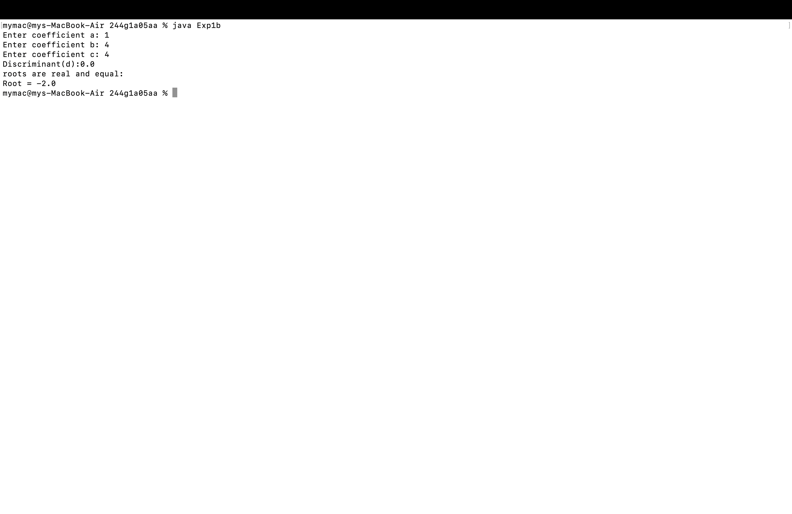

#Experiment1
## Title: 1a.) Display the primitive datatypes
```
class Default
{
int i;
float f;
boolean b;
byte by;
short s;
long l;
double d;
char c;
public static void main(String arg[])
{
Default obj=new Default();
System.out.println("Default int values:"+obj.i);
System.out.println("Default float values:"+obj.f);
System.out.println("Default boolean values:"+obj.b);
System.out.println("Default byte values:"+obj.by);
System.out.println("Default short values:"+obj.s);
System.out.println("Default long values:"+obj.l);
System.out.println("Default double values:"+obj.d);
System.out.println("Default char values:"+obj.c);
}
}

```
# output


## Title: 1b.) Display the quadratic roots
```
import java.util.Scanner;
public class Exp1b
 {
 public static void main(String[] args)
 {
 double a,b,c,d;
 Scanner Sc = new Scanner(System.in);
 System.out.print("Enter coefficient a: ");
 a=Sc.nextDouble();
 b=Sc.nextDouble();
 System.out.print("Enter coefficient c: ");
 c=Sc.nextDouble();
 d = b * b - 4 * a * c;
 System.out.println("Discriminant(d):"+ d);
 if (d > 0)
 {
  double x1 = (-b + Math.sqrt(d)) / (2 * a);
  double x2 = (-b - Math.sqrt(d)) / (2 * a);
  System.out.println("roots are real and distinct:");
  System.out.println("Root 1 = " + x1);
  System.out.println("Root 2 = " + x2);
 }
 System.out.print("Enter coefficient b: ");
 else if (d == 0)
 {
  double x = -b / (2 * a);
  System.out.println("roots are real and equal:");
  System.out.println("Root = " + x);
 }
 else
 {
  double realPart = -b / (2 * a);
  double imaginaryPart = Math.sqrt(-d) / (2 * a);
  System.out.println("Complex roots:");
  System.out.println("Root 1 = " + realPart + " + " + imaginaryPart + "i");
  System.out.println("Root 2 = " + realPart + " - " + imaginaryPart + "i");
}
Sc.close();
}
}
```
# output



